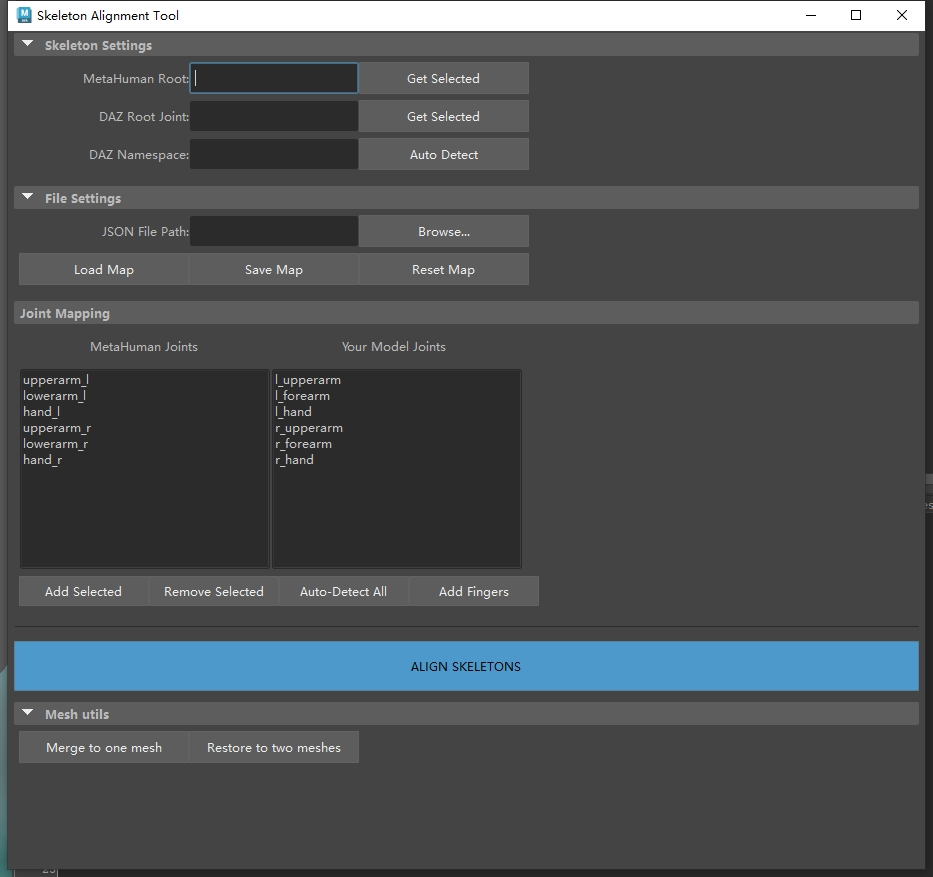

<p align="right">
  <strong>English</strong> |
  <a href="README.zh-CN.md">中文</a>
</p>

# Introduction  

PoseMatcher is a tool for pose alignment, currently focused on aligning non-Metahuman humanoid characters to the default Metahuman pose. It has been tested with DAZ8, DAZ9, and Mixamo models.

# Usage  
1. Copy the script **PoseMatcher.py** into your Maya and run it as a Python script.  
2. In the UI window, specify the root joints of the Metahuman and DAZ models.  
3. Verify that the DAZ namespace is correct.  
4. Load the JSON file that defines the bone-pair mapping from Metahuman to your model.  Please modify by yourself if needed.
5. Click **Load Map**.  
6. Click **ALIGN SKELETONS**.

# Troubleshooting  
If you encounter a “numpy not found” error, install it via **mayapy** as follows:  
```
"C:\Program Files\Autodesk\Maya2025\bin\mayapy.exe" -m pip install numpy
```

# License  
You may modify and distribute the code freely. For commercial use, please contact me first.

# Note
1. Please check your json file which maps the joints between metahuman and your own model.
2. The auto-detection feature is very unstable; please avoid using it whenever possible.