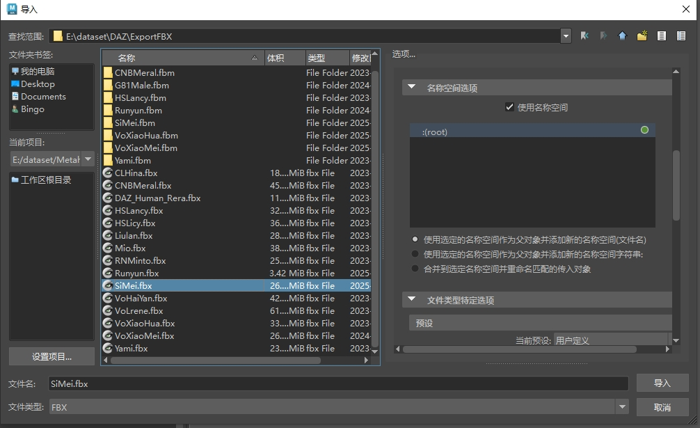
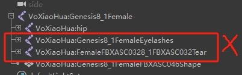

<p align="right">
  <a href="README.md">English</a> |
  <strong>中文</strong>
</p>

# 简介  

PoseMatcher 是一款姿态对齐工具，当前主要用于将非 Metahuman 的人形角色对齐到默认 Metahuman 姿态。已在 DAZ8、DAZ9 及 Mixamo 模型上测试通过。

# 使用方法  
1. 将脚本 PoseMatcher.py 复制到 Maya 并以 Python 脚本形式运行。
2. 在弹出的 UI 窗口中，分别指定 Metahuman 与 DAZ 模型的根关节。
3. 确认 DAZ 的命名空间无误。
4. 加载定义 Metahuman 与你模型骨骼对应关系的 JSON 文件。请酌情自行修改。
5. 点击 Load Map。
6. 点击 ALIGN SKELETONS 进行对齐。

# 问题
若出现 “numpy not found” 错误，请通过 mayapy 安装：
```
"C:\Program Files\Autodesk\Maya2025\bin\mayapy.exe" -m pip install numpy
```

# 版权
代码可自由修改与分发。若用于商业用途，请先与我联系。

# 注意
1. 请仔细检查映射 Metahuman 与你模型关节的 JSON 文件。
2. 自动检测功能极不稳定，请尽量避免使用。
3. 请不要直接将FBX拖入maya，请使用maya的导入按钮并且注意使用命名空间 \

4. 不要导入相同的骨骼，尤其是daz \
